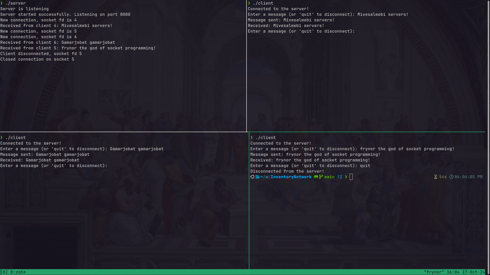

# Visual Representation 🖥️

**In this image, 2 clients are connected to one server and the third client disconnected after writing 'quit'**

**You could use two or three (limit is five) different machines and it still work, however you must be connected with same network. You could host server from one machine and connect with client mode in another.**
